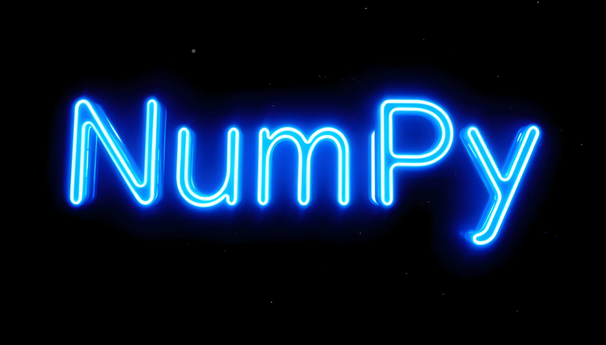

# CATopalian PY NumPy Tutorials

Welcome to the **College of Scripting Music & Science**. 

This repository is a living textbook designed to teach the absolute bedrock of high-performance computing and matrix mathematics in Python using **NumPy**. 



## The Mission

How does an autonomous, flying life-preserver instantly locate a survivor in a chaotic ocean? How do advanced tactical defense networks calculate interception trajectories in a fraction of a second? 

They do not use standard programming loops. Standard loops are too slow to save a life. 

Real-world intelligence, whether it is computer vision for rescue robotics, spatial physics for defense systems, or the neural pathways of True AI, relies on **Vectorization**. By structuring data into raw mathematical grids (Tensors) and processing them simultaneously on the hardware level, we can achieve computational speeds that make real-time robotics possible. 

This curriculum bridges the gap between basic coding and digital physics. You will learn how to shape, filter, and manipulate massive arrays of data without writing a single `for` loop.

---

## The Curriculum Roadmap

This repository is structured sequentially. Please proceed through the chapters in order.

---

## Getting Started

To run these modules, you will need:
1. **Python** installed on your system.
2. The **NumPy** library. 

You can install the required library by opening your terminal or command prompt and running:
```bash
pip install numpy
```

---

# TUTORIALS

### `00_Introduction_and_Setup`
* **00.1** - Installing NumPy and preparing the environment.

---

### `01_Array_Foundations]`
* **01.1** - Scalars, Vectors, and Matrices (0D, 1D, 2D)  [tutorial](src/tutorials/01_Array_Foundations/01.1_scalars_vectors_matrices/scalars_vectors_matrices.md), [script](src/tutorials/01_Array_Foundations/01.1_scalars_vectors_matrices/scalars_vectors_matrices.py)

* **01.2** - Generating Grids and Zeros [tutorial](src/tutorials/01_Array_Foundations/01.2_generating_grids_and_zeros/generating_grids_and_zeros.md), [script](src/tutorials/01_Array_Foundations/01.2_generating_grids_and_zeros/generating_grids_and_zeros.py)

### `02_Vector_Mathematics`
* **02.1** - Vector Addition and Spatial Math [tutorial](src/tutorials/02_Vector_Mathematics/02.1_vector_addition/vector_addition.md), [script](src/tutorials/02_Vector_Mathematics/02.1_vector_addition/vector_addition.py),
* **02.2** - Broadcasting and Scaling [tutorial](src/tutorials/02_Vector_Mathematics/02.2_broadcasting_and_scaling/broadcasting_and_scaling.md), [script](src/tutorials/02_Vector_Mathematics/02.2_broadcasting_and_scaling/broadcasting_and_scaling.py)

---

### `03_Data_Filtering`
* **03.1** - Boolean Masking and Instant Filtering [tutorial](src/tutorials/03_Data_Filtering/03.1_boolean_masking/boolean_masking.md), [script](src/tutorials/03_Data_Filtering/03.1_boolean_masking/boolean_masking.py)

---

### How to Download this App
1. **Click** the green **Code Button** on this github page
2. Choose **Download ZIP**
3. **Save** the **Zip File**
4. **Extract All**
5. **Double click** the **README.md file** to open it in VSCode and Click Open Preview on the top right to view the formatted tutorial

---

Happy Scripting :-)

---

// Dedicated to God the Father  
// All Rights Reserved Christopher Andrew Topalian Copyright 2000-2026  
// https://github.com/ChristopherAndrewTopalian  
// https://github.com/ChristopherTopalian  
// https://sites.google.com/view/CollegeOfScripting

